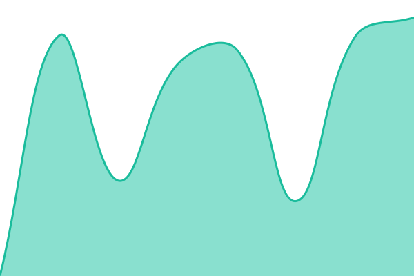
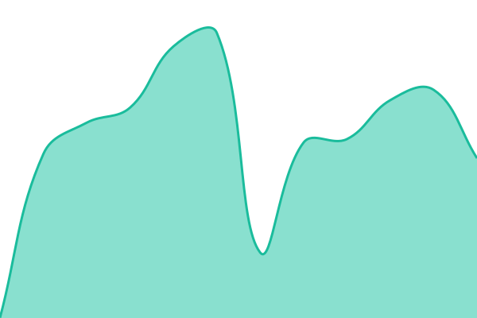
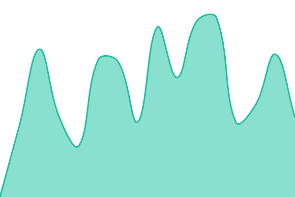

# [📈 Live Status](https://Kitkitkittt.github.io/service-status): <!--live status--> **🟧 Partial outage**

This repository contains the open-source uptime monitor and status page for [Kohnnn](https://Kitkitkittt.github.io/service-status), powered by [Upptime](https://github.com/upptime/upptime).

With [Upptime](https://upptime.js.org), you can get your own unlimited and free uptime monitor and status page, powered entirely by a GitHub repository. We use [Issues](https://github.com/Kitkitkittt/service-status/issues) as incident reports, [Actions](https://github.com/Kitkitkittt/service-status/actions) as uptime monitors, and [Pages](https://Kitkitkittt.github.io/service-status) for the status page.

<!--start: status pages-->
<!-- This summary is generated by Upptime (https://github.com/upptime/upptime) -->
<!-- Do not edit this manually, your changes will be overwritten -->
<!-- prettier-ignore -->
| URL | Status | History | Response Time | Uptime |
| --- | ------ | ------- | ------------- | ------ |
|  [9Router Web UI](https://9router.vnibb.xyz/) | 🟥 Down | [9-router-web-ui.yml](https://github.com/Kitkitkittt/service-status/commits/HEAD/history/9-router-web-ui.yml) | 

 1472ms
     
 | 

<a href="https://Kitkitkittt.github.io/service-status/history/9-router-web-ui">96.13%</a>
    

|  [9Router API Health](https://9router.vnibb.xyz/api/health) | 🟩 Up | [9-router-api-health.yml](https://github.com/Kitkitkittt/service-status/commits/HEAD/history/9-router-api-health.yml) | 

 464ms
     
 | 

<a href="https://Kitkitkittt.github.io/service-status/history/9-router-api-health">100.00%</a>
    

|  [9Router API Auth Boundary](https://9router.vnibb.xyz/v1/models) | 🟩 Up | [9-router-api-auth-boundary.yml](https://github.com/Kitkitkittt/service-status/commits/HEAD/history/9-router-api-auth-boundary.yml) | 

 486ms
     
 | 

<a href="https://Kitkitkittt.github.io/service-status/history/9-router-api-auth-boundary">7.08%</a>
    

|  [Research Wiki Liveness](https://research.vnibb.xyz/health/live) | 🟩 Up | [research-wiki-liveness.yml](https://github.com/Kitkitkittt/service-status/commits/HEAD/history/research-wiki-liveness.yml) | 

 685ms
     
 | 

<a href="https://Kitkitkittt.github.io/service-status/history/research-wiki-liveness">100.00%</a>
    

|  [Research Wiki Readiness](https://research.vnibb.xyz/health/ready) | 🟩 Up | [research-wiki-readiness.yml](https://github.com/Kitkitkittt/service-status/commits/HEAD/history/research-wiki-readiness.yml) | 

 4613ms
     
 | 

<a href="https://Kitkitkittt.github.io/service-status/history/research-wiki-readiness">100.00%</a>
    

|  [Research Wiki Application Auth Boundary](https://research.vnibb.xyz/) | 🟩 Up | [research-wiki-application-auth-boundary.yml](https://github.com/Kitkitkittt/service-status/commits/HEAD/history/research-wiki-application-auth-boundary.yml) | 

 411ms
     
 | 

<a href="https://Kitkitkittt.github.io/service-status/history/research-wiki-application-auth-boundary">5.93%</a>
    

|  [Research Wiki MCP Auth Boundary](https://research.vnibb.xyz/mcp/research-brain/) | 🟩 Up | [research-wiki-mcp-auth-boundary.yml](https://github.com/Kitkitkittt/service-status/commits/HEAD/history/research-wiki-mcp-auth-boundary.yml) | 

 264ms
     
 | 

<a href="https://Kitkitkittt.github.io/service-status/history/research-wiki-mcp-auth-boundary">5.49%</a>
    

<!--end: status pages-->

[**Visit our status website →**](https://Kitkitkittt.github.io/service-status)

## 📄 License

- Powered by: [Upptime](https://github.com/upptime/upptime)
- Code: [MIT](./LICENSE) © [Anand Chowdhary](https://anandchowdhary.com)
- Data in the `./history` directory: [Open Database License](https://opendatacommons.org/licenses/odbl/1-0/)
